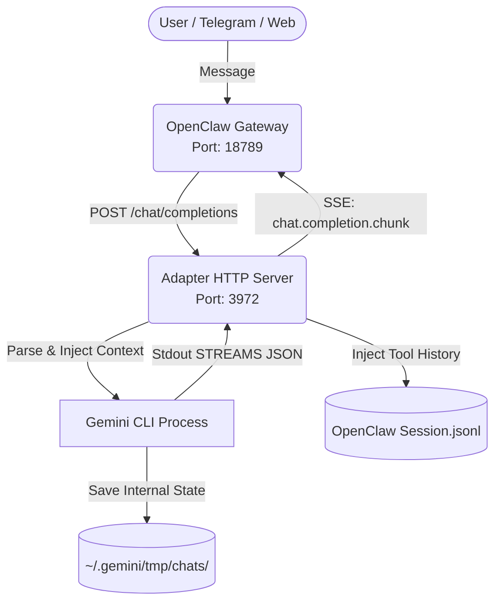

# OpenClaw ↔ Gemini CLI 統合機能 アーキテクチャ概要

## 1. システム全体像

## 2. コンポーネント一覧

### コンポーネントA: OpenClaw Gateway
- **役割**: クライアントからのメッセージやMCPツールの利用可能リストを集約し、設定ファイルに基づいてプロバイダへルーティングする。
- **技術スタック**: Node.js / Pi-ai
- **起動方法**: `node openclaw.mjs gateway --port 18789`

### コンポーネントB: Gemini CLI (Backend Engine)
- **役割**: 実際に推論を行い、指定されたツールを実行する。
- **起動方法**: Adapterから `spawn` される (`--yolo --resume <UUID> -o stream-json`)

### コンポーネントC: Gemini CLI Adapter (`src/server.js` ほか)
- **役割**: 両者の仕様の違い（API形式、履歴保持の仕組み、ストリーミング形式）を吸収するプロキシ。肥大化を防ぐため `src/` 配下に責務ごと（session, converter, injector, streaming）にモジュール分割されている。
- **起動方法**: `start.sh` または `node src/server.js` (Port: 3972)

## 3. 重要なファイルパス

| 種別 | パス | 説明 |
|------|------|------|
| 設定ファイル | `~/.openclaw/openclaw.json` | Geminiのアダプタを `openai-completions` として登録 |
| マッピング | `~/.gemini/openclaw-session-map.json` | OpenClawのKeyとGemini CLIのUUIDを紐付け |
| ログ | `/tmp/adapter_last_req.json` | OpenClawから飛んできた生リクエスト（デバッグ用） |
| ログ | `adapter.log` | アダプタ自身の動作ログ（重要） |
| 構成 | `gemini-cli-claw/src/` | アダプタのコアロジック群（server, streaming, injector 等）|

## 4. データフロー（ツール履歴注入の重要プロセス）

1. クライアントからの指示で OpenClaw が `messages` を構築し、AdapterへPOST。
2. Adapter はシステムプロンプトを分離し、過去の `messages` をGemini CLI側のセッションファイルに上書き同期。
3. Adapter が Gemini CLI を呼び出し、結果をストリーミング（SSE）で OpenClaw に返す。
4. **【重要】** SSE応答完了直後、Adapter は実際に使用された `tool_use` と `tool_result` のデータを、非同期でOpenClawの `.jsonl` セッションファイルの直近の `assistant` ブロックに無理やり注入（Inject）する。これにより次ターンのコンテキスト喪失を防ぐ。

## 5. 外部依存・前提条件
- **YOLOモード**: Gemini CLIは `--yolo` オプションを付けないとツール実行プロンプトでフリーズするため必須。

---

## 更新履歴
| 日付 | 変更内容 | 関連ADR |
|------|----------|---------|
| 2026-02-22 | 初版作成。これまでの仕様策定とデバッグ結果を反映 | ADR-001 ~ 004 |
