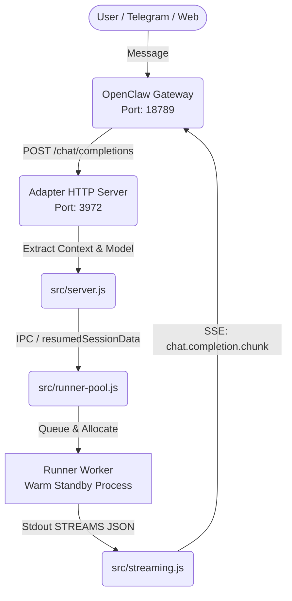

# OpenClaw ↔ Gemini CLI 統合機能 アーキテクチャ概要

## 1. システム全体像

## 2. コンポーネント一覧

### コンポーネントA: OpenClaw Gateway
- **役割**: クライアントからのメッセージやMCPツールの利用可能リストを集約し、設定ファイルに基づいてプロバイダへルーティングする。
- **技術スタック**: Node.js / Pi-ai
- **起動方法**: `node openclaw.mjs gateway --port 18789`

### コンポーネントB: Gemini CLI (Backend Engine)
- **役割**: 実際に推論を行い、指定されたツールを実行する。
- **起動方法**: `src/runner.js` （Runner Worker）経由で `runNonInteractive()` APIとしてメモリにロード・実行される。

### コンポーネントC: Gemini CLI Adapter (`src/server.js` ほか)
- **役割**: 両者の仕様の違い（API形式、履歴保持の仕組み、ストリーミング形式）を吸収するプロキシ。肥大化を防ぐため `src/` 配下に責務ごと（server, session, converter, streaming, runner-pool）にモジュール分割されている。
- **特徴**: 起動プロセスオーバーヘッドをなくすため、常時1つのGemini CLIプロセスをバックグラウンドで待機させておく「Warm Standby Runner Pool」パターンを採用。
- **起動方法**: `start.sh` または `node src/server.js` (Port: 3972)

## 3. 重要なファイルパス

| 種別 | パス | 説明 |
|------|------|------|
| **設定ファイル** | `~/.openclaw/openclaw.json` | プロバイダ設定およびUIに表示するGeminiモデル一覧（唯一の真実源） |
| **マッピング** | `~/.openclaw/gemini-session-map.json` | OpenClawのKeyとGemini CLIのUUIDを紐付け |
| **履歴データ** | `~/.openclaw/gemini-sessions/<session_key>/.gemini/tmp/openclaw-gemini-cli-adapter/chats/` | Geminiコマンドの作業ディレクトリ（内部セッション状態など） |
| **起動スクリプト** | `start.sh` | アダプタサーバーをバックグラウンドで起動 |
| **同期スクリプト** | `scripts/update_models.js` | Gemini CLIからモデル一覧を取得し、`openclaw.json` に同期する |
| **ログ** | `logs/adapter.log` | アダプタ自身の動作ログ（モデル選択やプロファイリング情報、重要） |
| **ログ** | `logs/adapter_last_req.json` | 最後に受け取ったHTTPリクエストの生データ（デバッグ用） |
| **ログ** | `openclaw-gateway.log` | OpenClaw側（Gateway）全体の通信ログ |

## 4. データフロー（モデル選択とコンテキストの伝播）

1. **モデル同期**: Gateway起動前に `update_models.js` が走り、最新のGeminiモデル一覧を `openclaw.json` に反映。
2. **リクエスト受信**: クライアント指示でOpenClawが `messages`（履歴含む）と指定された `model` 名を構築し、AdapterへPOST。
3. **パースとスタンバイ**: Adapter (`server.js`) はメッセージを抽出し、`messages` 配列と `model` 名をRunnerPoolへ渡す。
4. **推論実行**: RunnerPool は待機中のRunner WorkerへIPC（プロセス間通信）で `resumedSessionData`（履歴構造体全体）を送信。CLIプロセス内部の変数にコンテキストが直接注入される。
5. **ストリーミング返却**: Runnerの出力を `streaming.js` が検知・パースし、SSEフレームワークに変換してOpenClawへ返す。
6. **次ターン準備**: 完了後、Runnerはただちに次の使用に備えて破棄・再生成（Warm Standby）される。

## 5. 過去のアーキテクチャ（廃止済み）
- **プロセスSpawn方式**: リクエストごとに `bun gemini` コマンドを叩いていたため、約12秒の「起動税」がかかっていた。Runner Poolの導入により現在は**ゼロベース（瞬時起動）**に高速化された。
- **JSONL強制注入ハック**: 過去はツール履歴（`tool_use`、`tool_result`）を維持するために、通信終了後にAdapterが直接 `.jsonl` ファイルへ正規表現で強引に書き込む処理を行っていた。現在は `resumedSessionData` によるメモリへの直接渡しに変更され、より堅牢でクリーンな構造となっている。

---

## 更新履歴
| 日付 | 変更内容 | 関連コミット・セッション |
|------|----------|---------|
| 2026-02-22 | 初版作成。初期のプロキシ設計とデバッグ結果を反映 | セッション 1~4 |
| 2026-02-24 | RunnerPool（Warm Standby）導入、JSONLハック廃止、モデル動的同期、ログ集約の最新仕様に合わせて全面リライト | セッション 8~10 |
